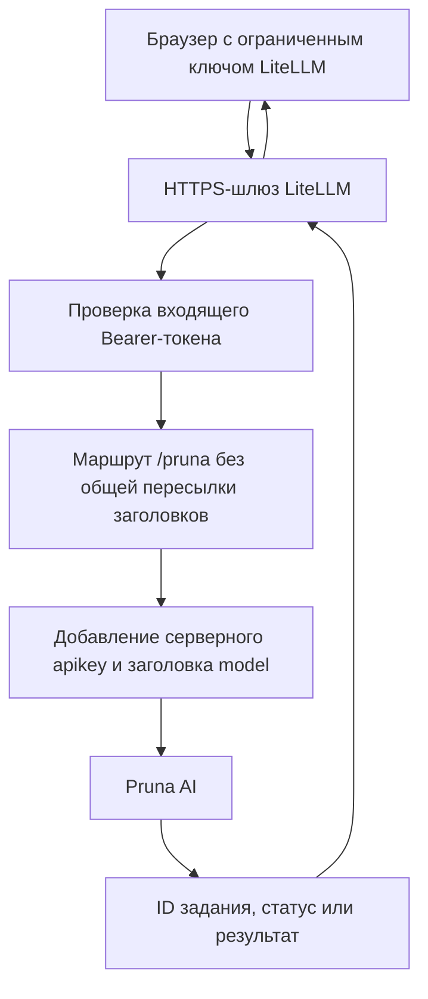
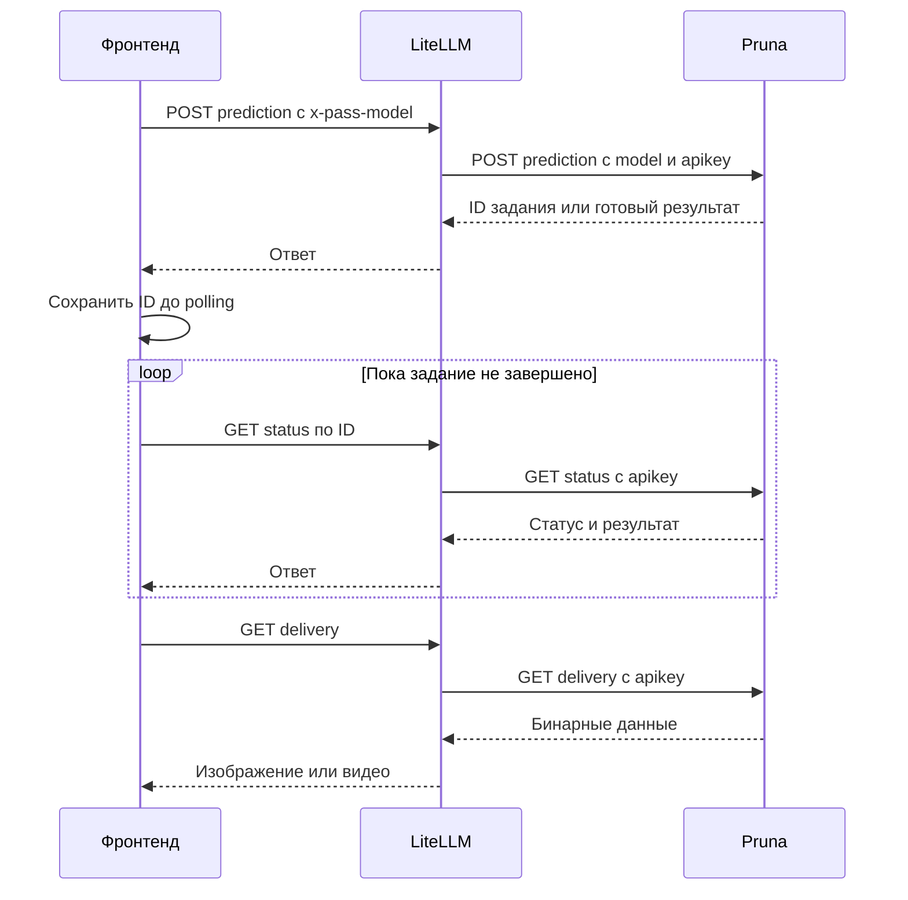

# Pruna AI через LiteLLM: как подключить генерацию к фронтенду и не застрять на CORS и 401

Подключение генерации изображений к веб-приложению выглядит просто: отправить prompt, дождаться результата, показать картинку. Но между браузером и API появляются CORS, два разных вида ключей, асинхронные задания и неожиданные конфликты заголовков.

LiteLLM можно использовать как шлюз к Pruna AI: браузер авторизуется на LiteLLM, а шлюз обращается к провайдеру со своим серверным ключом. Главная тонкость — **эти два уровня авторизации нельзя смешивать**. Иначе Pruna может вернуть `401`, даже если её API key установлен правильно.

Ниже — схема, которую можно использовать в разных проектах независимо от frontend-фреймворка. Она предполагает уже работающий LiteLLM с настроенной авторизацией и virtual keys; это не инструкция по установке LiteLLM с нуля.

> Поведение заголовков проверено на LiteLLM **1.84.0**, 9 октября 2026 года. В других версиях и редакциях поддержка custom pass-through, ограничения ключей и обработка заголовков могут отличаться. После обновления повторяйте проверки. Успешная генерация изображения не подтверждает поддержку всех edit- и video-моделей.

Все адреса на `example.com` ниже условные. Замените их своими адресами. Примеры с корректным `input` могут запускать **платную генерацию**.

## Зачем здесь нужен шлюз

Прямой вызов API из браузера подходит не всегда. Провайдер может не разрешать origin вашего сайта через CORS, а размещать серверный ключ Pruna в JavaScript-бандле небезопасно.

Шлюз разделяет эти задачи:



Это схема **браузер → LiteLLM → Pruna**, а не преобразование Pruna в OpenAI-compatible image API. Для генерации используется собственный predictions API Pruna: модель указывается в HTTP-заголовке, параметры — в JSON-поле `input`.

У шлюза остаётся своя CORS-конфигурация. Прокси не делает запросы автоматически same-origin, если сайт и LiteLLM работают на разных origins.

## Два ключа — два уровня авторизации

| Ключ | Где находится | Что авторизует |
| --- | --- | --- |
| Ограниченный virtual key LiteLLM | У клиентского приложения, если выбран прямой доступ браузера к шлюзу | Браузерные запросы к LiteLLM |
| `PRUNA_API_KEY` | Только в окружении сервера LiteLLM | Запросы LiteLLM к Pruna через `apikey` |
| `LITELLM_MASTER_KEY` | Только на сервере | Администрирование LiteLLM; не использовать в браузере |

Входящий запрос к LiteLLM выглядит так:

```http
Authorization: Bearer <LiteLLM virtual key>
x-pass-model: z-image-turbo
Content-Type: application/json
```

Исходящий запрос к Pruna должен выглядеть иначе:

```http
apikey: <server-side Pruna API key>
model: z-image-turbo
Content-Type: application/json
```

**Заголовка `Authorization` в запросе к Pruna в этой схеме быть не должно.**

Префиксы вроде `sk-…` и `pru_…` могут помочь заметить путаницу ключей, но не доказывают их действительность.

Для пользовательского приложения выдавайте отдельные ограниченные ключи, а не один общий ключ, встроенный в публичный бандл. Если хранить даже ограниченный ключ в браузере нежелательно, добавьте собственный backend: браузер авторизуется в нём через сессию, а backend обращается к LiteLLM. Правила заголовков между LiteLLM и Pruna остаются теми же.

## Рабочая конфигурация pass-through

Добавьте маршрут в существующий `config.yaml`, сохранив остальные настройки и маршруты:

```yaml
general_settings:
  master_key: os.environ/LITELLM_MASTER_KEY
  database_url: os.environ/DATABASE_URL
  pass_through_endpointsподтвердил:
    - path: "/pruna"
      target: "https://api.pruna.ai"
      include_subpath: true
      forward_headers: false
      auth: true
      headers:
        apikey: "os.environ/PRUNA_API_KEY"
```

Здесь важны пять параметров:

- **`target`** фиксирует upstream. Клиент не должен выбирать произвольный сервер, которому шлюз отправит секреты.
- **`include_subpath: true`** позволяет использовать вложенные маршруты загрузки, генерации, статуса и скачивания.
- **`auth: true`** требует авторизации входящего запроса к LiteLLM.
- **`forward_headers: false`** отключает общую пересылку клиентских заголовков, в частности `Authorization`.
- **`headers.apikey`** подставляет ключ Pruna из окружения процесса LiteLLM.

`master_key` и `database_url` относятся к общей настройке шлюза, а не к специальным параметрам Pruna. Сам фрагмент не создаёт virtual key и не заменяет настройку доступа.

### Почему правильный apikey может не спасти от 401

Кажется логичным включить `forward_headers: true`, чтобы браузерный заголовок `Model` дошёл до провайдера. Но вместе с ним шлюз пересылает и:

```http
Authorization: Bearer <LiteLLM virtual key>
```

Pruna получает одновременно правильный `apikey` и посторонний Bearer-токен. На проверенном API это приводило к ответу:

```json
{
  "title": "Unauthenticated",
  "detail": "You did not pass a valid authentication token",
  "status": 401
}
```

Проверки GET статуса с заведомо несуществующим ID дали следующие результаты:

| Заголовки upstream | Ответ |
| --- | --- |
| Только действующий `apikey` | `404`: задание не найдено, без ошибки токена |
| `apikey` плюс посторонний Bearer | `401`: недействительный токен |
| `apikey` плюс Bearer со значением ключа Pruna | `401`: недействительный токен |
| `apikey` плюс пустой `Authorization` | `401`: токен не передан |

Исправление — **не передавать `Authorization` upstream**, а не заменять его значение или делать его пустым. `null` в настройке заголовка тоже не означает «удалить заголовок» и может вызвать исключение HTTP-клиента о `NoneType`.

### Как передать модель без общей пересылки заголовков

Используйте специальный заголовок LiteLLM:

```http
x-pass-model: z-image-turbo
```

В проверенной версии LiteLLM снимает префикс `x-pass-` и передаёт его как:

```http
model: z-image-turbo
```

Этот механизм работает и при `forward_headers: false`. Обычный клиентский `Model` при такой конфигурации не пересылается.

Регистр здесь не важен: `Model` и `model` — один HTTP-заголовок. Важен именно специальный префикс. Не пытайтесь обойти разделение ключей через `x-pass-authorization`: в проверенной версии credential headers защищены этим механизмом.

JSON content type задаётся HTTP-клиентом шлюза. Multipart-загрузки LiteLLM перестраивает со своим boundary; не задавайте boundary вручную.

## Окружение Docker Compose: файл ещё не означает переменную в процессе

Частая ловушка: `PRUNA_API_KEY` уже записан в `.env`, но LiteLLM его не видит.

Compose использует `.env` для подстановки значений в конфигурацию. Это **не означает**, что все его переменные автоматически попадут в контейнер. Подключите `env_file` или явные записи `environment`.

Фрагмент для существующего Compose-сервиса:

```yaml
services:
  litellm:
    env_file:
      - .env
    volumes:
      - ./config.yaml:/app/config.yaml:ro
```

Предполагается, что сервис уже запускает LiteLLM с этим `config.yaml`. Это не полный Compose-файл: образ, command, порты и база данных зависят от вашего развёртывания.

Пример серверного окружения — значения секретов условные:

```dotenv
PRUNA_API_KEY=<Pruna provider secret>
LITELLM_MASTER_KEY=<LiteLLM server master key>
DATABASE_URL=<PostgreSQL connection URL>
LITELLM_CORS_ORIGINS=https://app.example.com,http://localhost:5173,http://127.0.0.1:5173
```

Не публикуйте серверный `.env`, не переносите ключ Pruna или master key в frontend-переменные вроде `VITE_*` или `NEXT_PUBLIC_*`.

Проверить наличие переменной без вывода её значения можно так. Здесь и далее Compose-команды выполняются в каталоге развёртывания; `litellm` — имя сервиса, которое нужно заменить, если у вас оно другое.

```sh
docker compose exec -T litellm python -c 'import os; v = os.environ.get("PRUNA_API_KEY"); print("PRUNA_API_KEY:", "MISSING" if v is None else "EMPTY" if not v.strip() else "SET")'
```

`SET` подтверждает только наличие непустого значения, не действительность ключа. Проверка окружения в SSH shell не заменяет проверку внутри работающего контейнера.

## CORS: разрешайте origin сайта, а не URL страницы

В LiteLLM `1.84.0` переменная `LITELLM_CORS_ORIGINS` читается как список origins через запятую:

```dotenv
LITELLM_CORS_ORIGINS=https://app.example.com,http://localhost:5173,http://127.0.0.1:5173
```

Origin состоит из схемы, hostname и порта. Пути в нём нет:

```text
Правильно:   https://app.example.com
Правильно:   http://localhost:5173
Неправильно: https://app.example.com/my-project/
```

`localhost` и `127.0.0.1` — разные origins. Другой порт dev-сервера тоже требует отдельной записи. Не допускайте пробелов или переносов внутри hostname.

Для JSON submission с авторизацией браузер отправит `OPTIONS` preflight. Ответ должен разрешать:

- origin вашего сайта;
- метод `POST`;
- заголовки `authorization`, `content-type`, `x-pass-model`.

Для polling и delivery нужен доступ к `GET`, для upload — к `POST`. Убедитесь, что CORS-заголовки есть и в ответах с ошибками: иначе читаемый `401` или `400` превращается в браузере в общий сетевой сбой.

Не используйте `mode: 'no-cors'`: opaque response нельзя прочитать. Не отправляйте приватные исходники и ключи через публичные CORS-прокси. CORS не является авторизацией и не защищает шлюз от запросов вне браузера.

## Адреса: не путайте text API и Pruna gateway

У одного шлюза могут быть разные базовые адреса:

```text
OpenAI-compatible text API: https://ai.example.com/v1
Pruna pass-through:         https://ai.example.com/pruna
```

Для фронтенда удобно хранить **полный адрес Pruna gateway отдельно**, а не вычислять его из text API URL. Это сохраняет поддержку дополнительного префикса reverse proxy, например `https://ai.example.com/ai/pruna`.

| Операция | Запрос к шлюзу | Запрос LiteLLM к Pruna |
| --- | --- | --- |
| Загрузка исходника | `POST /pruna/v1/files` | `POST /v1/files` |
| Создание задания | `POST /pruna/v1/predictions` | `POST /v1/predictions` |
| Статус | `GET /pruna/v1/predictions/status/{id}` | `GET /v1/predictions/status/{id}` |
| Результат | `GET /pruna/v1/predictions/delivery/{path}` | `GET /v1/predictions/delivery/{path}` |

Публичный gateway URL должен быть окончательным HTTPS-адресом, без встроенных username/password. Если используется path prefix, reverse proxy должен корректно отображать его на маршрут LiteLLM.

## Минимальный frontend-запрос

Пример использует обычный `fetch` и не зависит от React, Vue или другого фреймворка. `gatewayBaseUrl` — полный адрес маршрута, например `https://ai.example.com/pruna`, **не** текстовый URL с `/v1`.

```js
async function submitPruna({ gatewayBaseUrl, virtualKey, model, input, signal }) {
  const base = new URL(gatewayBaseUrl)
  if (base.protocol !== 'https:' || base.username || base.password) {
    throw new Error('Use an HTTPS gateway URL without embedded credentials.')
  }
  if (base.search || base.hash) {
    throw new Error('Gateway base URL must not contain a query or fragment.')
  }
  if (!virtualKey?.trim() || !model?.trim()) {
    throw new Error('A gateway key and model are required.')
  }

  const endpoint = `${base.href.replace(/\/+$/, '')}/v1/predictions`
  const response = await fetch(endpoint, {
    method: 'POST',
    headers: {
      Authorization: `Bearer ${virtualKey}`,
      'Content-Type': 'application/json',
      'x-pass-model': model,
    },
    body: JSON.stringify({ input }),
    credentials: 'omit',
    redirect: 'error',
    signal,
  })

  if (!response.ok) {
    // Не включайте ключи и полные request headers в ошибки или логи.
    throw new Error(`Generation gateway returned HTTP ${response.status}`)
  }
  return response.json()
}
```

Это пример HTTP-контракта, а не готовый production-клиент. Перед вызовом валидируйте модель и параметры; после ответа обработайте ID, статус и результат. Если чтение ответа не удалось после успешного `POST`, исход операции тоже может быть неизвестен: не повторяйте запрос автоматически.

`credentials: 'omit'` исключает cookies, но **не удаляет явно заданный `Authorization`**. `redirect: 'error'` запрещает автоматически следовать перенаправлению. Устраните redirects на маршруте шлюза заранее.

### Параметры зависят от модели

Пример тела для `z-image-turbo`:

```json
{
  "input": {
    "prompt": "A lighthouse above a storm",
    "width": 1024,
    "height": 1024
  }
}
```

Пример для `p-image`:

```json
{
  "input": {
    "prompt": "A lighthouse above a storm",
    "aspect_ratio": "1:1"
  }
}
```

Это два разных контракта. Не переводите все модели на `width`/`height` или все на `aspect_ratio`. В интерфейсе выбранный ratio может выглядеть как размер, но это не обещание точного разрешения результата.

Для редактирования и видео тоже проверяйте документацию конкретной модели. Например, `p-image-edit` использует массив `images`, а `qwen-image-edit-plus` — массив `image`. Даже похожие модели могут иметь разные параметры, допустимые значения и ограничения исходников.

Опции ускорения, качества и safety checker не являются настройками шлюза. Не копируйте `disable_safety_checker: true` из сторонних примеров без определения политики модерации вашего продукта. Цены и доступность моделей проверяйте отдельно: статическая оценка в интерфейсе не доказывает фактическое списание.

## Асинхронная генерация: POST — только начало

Без `Try-Sync` используйте асинхронный сценарий. Обработчик при этом должен учитывать и ответ с уже готовым результатом, если API его вернул.



Для надёжного клиента:

1. Зафиксируйте параметры задания и исходники до отправки.
2. Получив ID, сохраните его **до первого polling-запроса**, чтобы продолжить ожидание после перезагрузки.
3. Проверяйте статус последовательно, без перекрывающихся запросов. Интервал около двух секунд может быть отправной точкой; учитывайте rate limits, `429` и рекомендации API.
4. Разделяйте состояния ожидания, успеха и terminal failure. Точные значения статусов берите из актуального контракта, а неизвестные обрабатывайте явно и с ограниченным временем ожидания.
5. Разбирайте форму результата по API schema. В проверенной интеграции встречались `generation_url` и `output`, включая массивы.
6. Установите собственные deadlines и лимит параллельных заданий. Это продуктовые ограничения, а не свойства LiteLLM или Pruna.

Polling и delivery должны использовать тот же gateway и тот же контекст авторизации, что и submission. Не переключайте аккаунт посреди задания после изменения пользовательских настроек.

Если ожиданием управляет браузер, закрытие вкладки или приостановка мобильного браузера может его прервать. Для надёжного фонового выполнения нужен серверный worker либо другой поддерживаемый провайдером механизм завершения.

### Загрузка исходников для image-to-image

Загрузка идёт через шлюз:

```text
POST https://ai.example.com/pruna/v1/files
```

Используйте `FormData` с полем `content`. Браузер сам задаст multipart boundary; не устанавливайте `Content-Type` вручную.

После upload извлеките ссылку из документированного ответа. В проверенной интеграции использовались `urls.get` или `url`; если API возвращает только ID, строить `/v1/files/{id}` можно лишь при наличии такого контракта.

В prediction передавайте **ссылку Pruna**, а не браузерный gateway URL:

```text
https://api.pruna.ai/v1/files/<uploaded-file-id>
```

Провайдеру нужен адрес своего исходника. Перед использованием проверьте ожидаемый origin `https://api.pruna.ai` и путь `/v1/files/`. Число исходников и поле `image`/`images` зависят от модели.

### Скачивание результата и качественный preview

Защищённую delivery-ссылку нельзя просто положить в ``: элемент не добавит нужные API-заголовки. Получайте результат через авторизованный `fetch` к LiteLLM:

1. Проверьте origin и разрешённый delivery path URL из ответа провайдера.
2. Отобразите его на маршрут шлюза, сохранив нужные path и query, но не позволяя ответу выбрать произвольный хост.
3. Скачайте данные с virtual key LiteLLM.
4. Проверьте лимит размера, тип и сигнатуру файла, для изображения — ещё и dimensions.
5. Создайте `Blob` и object URL для показа.
6. Вызовите `URL.revokeObjectURL()` при замене результата или уничтожении компонента.

Лимиты bytes и разрешения выбирайте под устройство и продукт. При скачивании проверяйте фактически прочитанные bytes, а не только `Content-Length`: этот заголовок может отсутствовать или быть недостоверным.

Если оригинал чёткий, а preview зернистый, проверьте источник preview. Не растягивайте маленькую thumbnail на большую карточку: используйте оригинал либо отдельную версию с достаточным разрешением с учётом размера элемента и device pixel ratio. Для видео обычно удобнее отдельный poster. Это исправляет отображение, но не повышает качество самой генерации.

## Неизвестный исход запроса — не повод для автоматического retry

После сетевой ошибки возможны два сценария: запрос не дошёл до Pruna либо дошёл и создал задание, но ответ потерялся. По одному исключению `fetch` отличить их нельзя.

Поэтому:

- не повторяйте платный submission автоматически после неизвестного результата;
- если ID сохранён, продолжайте polling того же задания;
- если ID неизвестен, проверьте историю провайдера перед новой попыткой;
- считайте повторную генерацию отдельным пользовательским действием с возможным новым списанием;
- не обещайте отмену или возврат денег при вызове `AbortController`: он останавливает локальное ожидание, не обязательно работу провайдера.

Идемпотентность допустима только при документированной поддержке API. Произвольный клиентский request ID сам по себе не предотвращает повторное списание.

## Безопасность публичного шлюза

`auth: true` и CORS — необходимые части настройки, но не вся политика доступа.

`x-pass-model` контролируется клиентом. Проверяйте на сервере разрешённые маршруты и модели, ограничения размера upload, частоту запросов и расходы. **Не предполагайте**, что custom pass-through автоматически наследует все лимиты, бюджеты и тарификацию запросов из `model_list`: это зависит от версии, редакции и конфигурации LiteLLM.

Ограниченный virtual key в `localStorage` всё равно доступен при XSS. Нужны защита frontend, отзыв ключей и проверка реальных прав pass-through. Если требуемые ограничения не обеспечиваются шлюзом, добавьте собственный backend с явной политикой доступа.

Не логируйте ключи и не публикуйте полный DevTools «Copy as cURL»: там может быть действующий `Authorization`. Перед отправкой диагностических данных удаляйте credentials, cookies и приватное содержимое запросов.

## Диагностика: где искать ошибку

| Симптом | Что проверить |
| --- | --- |
| Общая сетевая ошибка `fetch` | DNS, TLS, доступность шлюза, CORS и redirects. Это не точный диагноз CORS и не доказательство отказа провайдера |
| Preflight не разрешает origin | Схему, hostname, порт, отсутствие path и окружение работающего контейнера |
| Запрос работает через curl, но не в браузере | curl не применяет browser CORS; проверьте `OPTIONS` с реальным Origin |
| `401` от LiteLLM | Действительность virtual key, права на маршрут и поддержку custom pass-through authentication |
| Pruna `401` с `Unauthenticated` | Пересылку `Authorization` upstream, затем действительность серверного `apikey` |
| `401` при наличии `x-pass-model` в DevTools | Заголовок модели не доказывает применение серверного `forward_headers: false` |
| `Missing or unsupported model` | Передаётся ли `x-pass-model`, преобразует ли его установленная версия LiteLLM, поддерживается ли модель |
| `property input is required` | Есть ли обязательное поле `input`; для неполного диагностического запроса это ожидаемый ответ |
| `Header value must be str or bytes, not NoneType` | Traceback HTTP-клиента, конфигурацию заголовков, значения `null` и переменные в процессе LiteLLM |
| Polling работает, delivery — нет | Вложенный маршрут, URL allowlist, авторизацию, ограничения bytes и сигнатуру результата |

LiteLLM может обернуть ответ Pruna ещё одним JSON:

```json
{
  "error": {
    "message": "{\"title\":\"Unauthenticated\",\"detail\":\"You did not pass a valid authentication token\",\"status\":401}",
    "type": "None",
    "param": "None",
    "code": "401"
  }
}
```

Строки `"None"` в таком wrapper не доказывают, что frontend забыл ключ. Смотрите вложенный `error.message`, HTTP status и источник ответа в логах. Важно отличать отказ LiteLLM до отправки запроса от отказа upstream `https://api.pruna.ai`.

## Как применить изменения и проверить их без платной генерации

### Restart и recreate — не одно и то же

Если изменился только bind-mounted `config.yaml`, перезапустите сервис:

```sh
docker compose restart litellm
```

Проверьте, что контейнер видит актуальный файл. При изменении mounts, Compose-конфигурации или необходимости перепривязать файл нужен recreate.

Если изменилось окружение, простой restart **не обновит env контейнера**:

```sh
docker compose up -d --no-deps --force-recreate litellm
```

Перед изменениями сохраните конфигурацию и учтите перерыв обслуживания. Не используйте `docker compose down -v` для исправления заголовков или CORS: удаление volumes может уничтожить данные.

Деплой клиента и шлюза должен быть согласован. Старый клиент с обычным `Model` потеряет модель после отключения forwarding; новый клиент с `x-pass-model` всё ещё получит конфликт авторизации, если шлюз продолжает пересылать Bearer. Не сохраняйте небезопасное forwarding как долгосрочный способ совместимости.

После перезапуска LiteLLM может некоторое время выполнять миграции и запускать HTTP-сервер. Статус контейнера `Up` не означает готовность обслуживать запросы; фиксированная пауза тоже не заменяет health check.

### 1. Проверить доступность HTTP-сервера

```sh
curl -fsS --max-time 10 https://ai.example.com/health/liveliness
```

Ожидается `200`, если endpoint опубликован в вашей топологии. Это liveness-проверка HTTP-сервера, не подтверждение готовности всех зависимостей, доступа к Pruna или баланса.

### 2. Проверить browser preflight

```sh
curl -sS --max-time 15 -D - -o /dev/null -X OPTIONS \
  'https://ai.example.com/pruna/v1/predictions' \
  -H 'Origin: https://app.example.com' \
  -H 'Access-Control-Request-Method: POST' \
  -H 'Access-Control-Request-Headers: authorization,content-type,x-pass-model'
```

В проверенной конфигурации ответ был `200`; допустим и `204`, если нужные CORS-заголовки присутствуют. Для локального frontend повторите проверку с `Origin: http://localhost:5173`. API key не нужен, prediction не создаётся.

### 3. Убедиться, что шлюз не открыт без ключа

```sh
curl -sS --max-time 10 -o /dev/null -w 'HTTP %{http_code}\n' \
  'https://ai.example.com/pruna/v1/predictions/status/00000000000000000000000'
```

Без `Authorization` ожидается **`401` от шлюза**. Если запрос проходит к провайдеру, остановите публикацию и проверьте защиту маршрута. Один status code не всегда показывает источник ошибки — сверяйтесь с логами.

### 4. Проверить upstream-авторизацию и заголовок модели

В доверенном инструменте повторите GET статуса с virtual key LiteLLM и заведомо несуществующим ID. В проверенной конфигурации Pruna возвращала `404`, а не ошибку токена. Этот ответ полезен вместе с логами, но не подтверждает поддержку модели или возможность генерации.

Для проверки передачи модели можно отправить авторизованный `POST /pruna/v1/predictions` с `x-pass-model: z-image-turbo` и **неполным телом `{}`**. На проверенном API ответ — `400` с `property input is required`, без создания prediction. После изменения API проверяйте эти ожидания заново. Не добавляйте валидный `input`: это уже может быть платный запрос.

`HEAD` к общему `/v1/predictions` не является надёжной проверкой авторизации: неподдерживаемый метод может дать одинаковый `404` с правильными и неправильными заголовками.

### 5. Посмотреть состояние и логи

```sh
docker compose ps
docker compose logs --no-color --tail=100 litellm
```

Ищите завершение startup, ошибки конфигурации и миграций, конкретный upstream URL и HTTP status. Перед публикацией логов проверьте их на секреты и персональные данные.

Для автоматизации разделяйте frontend-тесты с mock responses и интеграционные проверки настоящего шлюза. Имитация `forward_headers: false` в тесте не доказывает, что удалённый LiteLLM действительно настроен так же. Платные end-to-end проверки должны запускаться отдельно и явно.

## Чек-лист перед запуском

- [ ] Браузер использует ограниченный ключ LiteLLM, не Pruna key и не master key.
- [ ] Ключ Pruna доступен процессу шлюза, не только записан в `.env`.
- [ ] Маршрут имеет `auth: true`, `include_subpath: true`, `forward_headers: false`.
- [ ] Запрос без ключа отклоняется шлюзом.
- [ ] `x-pass-model` преобразуется в `model`; `Authorization` не попадает в Pruna.
- [ ] Разрешены production и нужные local origins без path.
- [ ] Preflight и CORS на ошибках работают.
- [ ] Тело содержит `input` по контракту конкретной модели.
- [ ] Upload, polling и delivery проходят через шлюз; file URLs в prediction остаются upstream URLs.
- [ ] ID сохраняется до polling; восстановление не создаёт новое задание.
- [ ] Неизвестный исход submission не вызывает автоматический платный retry.
- [ ] URL и файлы проверяются; object URLs освобождаются.
- [ ] Права, модели, лимиты и расходы pass-through проверены на сервере.
- [ ] После обновления env контейнер пересоздан, после перезапуска проверен HTTP endpoint.

## Главное

В этой интеграции LiteLLM — не просто средство обхода CORS. Это **граница между клиентской и провайдерской авторизацией**. Браузерный Bearer заканчивается на шлюзе; к Pruna идёт серверный `apikey`. Для модели используйте `x-pass-model`, а не общую пересылку заголовков.

После настройки этой границы остаются обычные задачи надёжного клиента: сохранить ID, дождаться результата, безопасно скачать его и не превратить сетевой сбой в повторное списание.

## Документация и первоисточники

- [Pruna API reference](https://docs.api.pruna.ai/apis).
- [Pruna OpenAPI schema](https://docs.api.pruna.ai/openapi.yaml).
- [Pruna P-Image: predictions API](https://docs.api.pruna.ai/guides/models/p-image).
- [LiteLLM custom pass-through endpoints](https://docs.litellm.ai/docs/proxy/pass_through).
- [Реализация forwarding в LiteLLM](https://github.com/BerriAI/litellm/blob/main/litellm/passthrough/utils.py). Ссылка ведёт на upstream `main`, а не на установленную версию.

Если пример из документации расходится с реальным поведением, проверяйте код установленной версии, конфигурацию работающего процесса и реальные ответы шлюза. Не включайте пересылку `Authorization` ради передачи модели.
